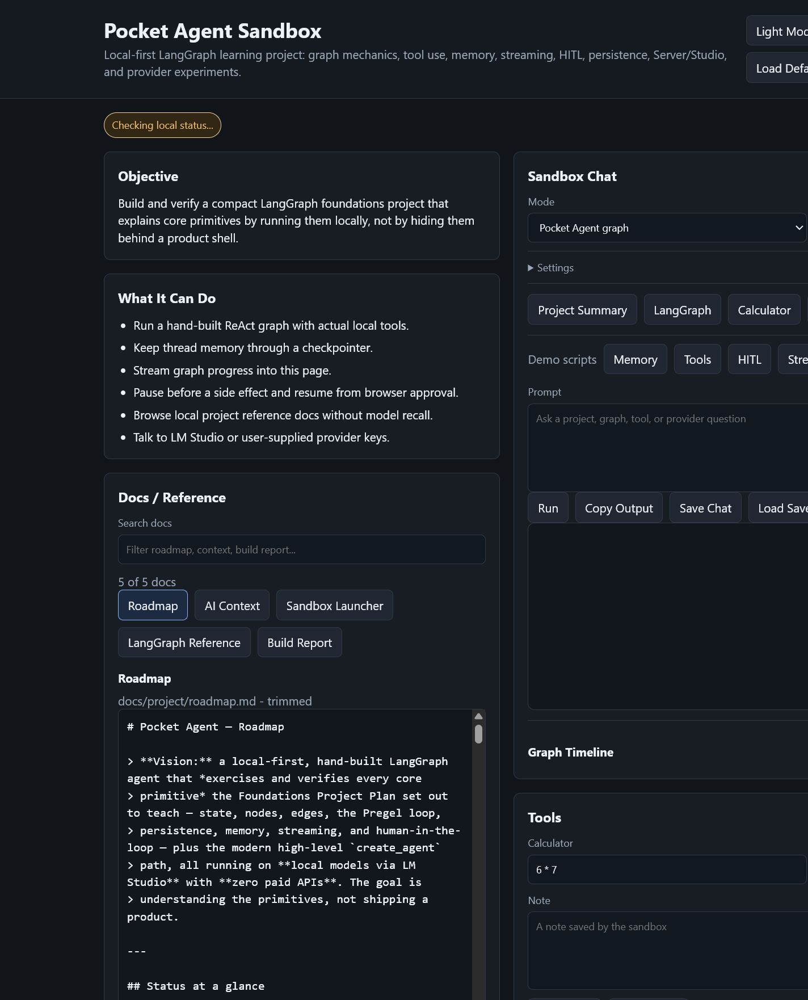
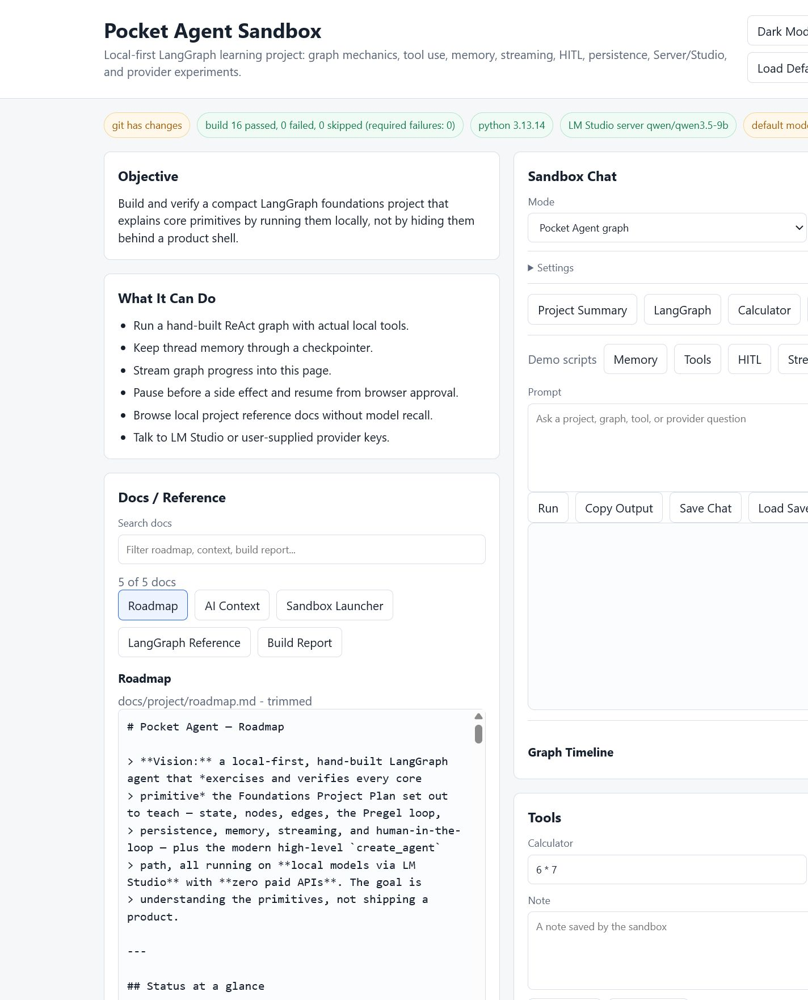
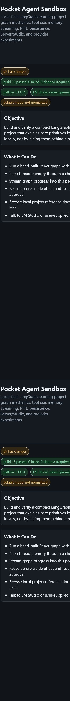
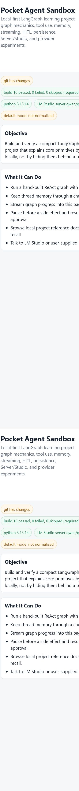

# Sandbox UI QA Report

Date: 2026-07-05

Target: `http://127.0.0.1:8800`

Browser: Codex in-app browser

## Scope

This QA package captures the current Pocket Agent sandbox UI in the main visual
states that are most likely to regress:

- Desktop dark mode
- Desktop light mode
- Mobile dark mode
- Mobile light mode

## Artifacts

| State | Viewport | File |
|---|---:|---|
| Desktop dark | 1440 x 1000 | [desktop_dark.png](desktop_dark.png) |
| Desktop light | 1440 x 1000 | [desktop_light.png](desktop_light.png) |
| Mobile dark | 390 x 780 | [mobile_dark.png](mobile_dark.png) |
| Mobile light | 390 x 780 | [mobile_light.png](mobile_light.png) |

## Checks Performed

- Page title and header rendered as `Pocket Agent Sandbox`.
- Required UI controls were present:
  - theme toggle
  - provider preset
  - docs search
  - save/load/export chat
  - graph timeline
  - tool trace
  - run prompt
  - HITL start
  - calculator tool
- Theme state matched each screenshot target.
- Desktop viewport had no horizontal overflow.
- Mobile viewport had no horizontal overflow.
- Browser console had no warnings or errors during capture.

## Results

| State | Theme confirmed | Missing controls | Horizontal overflow |
|---|---|---:|---|
| Desktop dark | yes | 0 | no |
| Desktop light | yes | 0 | no |
| Mobile dark | yes | 0 | no |
| Mobile light | yes | 0 | no |

## Screenshots

## Limitations

- This pass validates visual layout and core UI presence, not live OpenAI,
  Anthropic, or Gemini API-key calls.
- This is not a full accessibility audit.
- The sandbox was run in deterministic mock mode for stable local validation.
